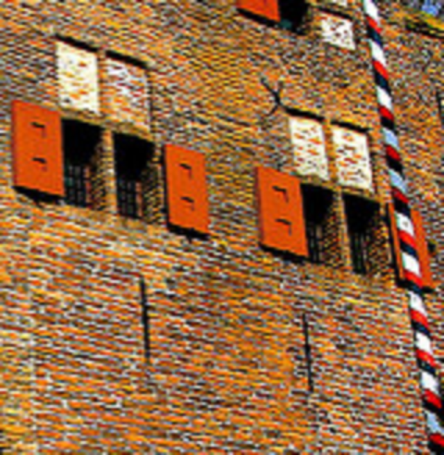
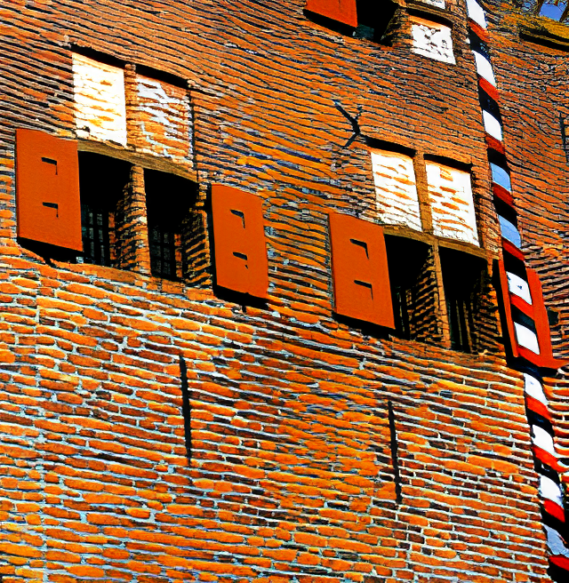

# SwinIR: Image Restoration Using Swin Transformer
[Jingyun Liang](https://jingyunliang.github.io), [Jiezhang Cao](https://www.jiezhangcao.com/), [Guolei Sun](https://vision.ee.ethz.ch/people-details.MjYzMjMw.TGlzdC8zMjg5LC0xOTcxNDY1MTc4.html), [Kai Zhang](https://cszn.github.io/), [Luc Van Gool](https://scholar.google.com/citations?user=TwMib_QAAAAJ&hl=en), [Radu Timofte](http://people.ee.ethz.ch/~timofter/)

Computer Vision Lab, ETH Zurich

---

[](https://arxiv.org/abs/2108.10257)
[](https://github.com/JingyunLiang/SwinIR)
[](https://github.com/JingyunLiang/SwinIR/releases)

[ <a href="https://colab.research.google.com/gist/JingyunLiang/a5e3e54bc9ef8d7bf594f6fee8208533/swinir-demo-on-real-world-image-sr.ipynb"></a>](https://colab.research.google.com/gist/JingyunLiang/a5e3e54bc9ef8d7bf594f6fee8208533/swinir-demo-on-real-world-image-sr.ipynb)
<a href="https://replicate.ai/jingyunliang/swinir"></a>
[](https://playtorch.dev/snack/@playtorch/swinir/)
[Gradio Web Demo](https://huggingface.co/spaces/akhaliq/SwinIR)

This repository is the official PyTorch implementation of SwinIR: Image Restoration Using Shifted Window Transformer
([arxiv](https://arxiv.org/pdf/2108.10257.pdf), [supp](https://github.com/JingyunLiang/SwinIR/releases), [pretrained models](https://github.com/JingyunLiang/SwinIR/releases), [visual results](https://github.com/JingyunLiang/SwinIR/releases)). SwinIR achieves **state-of-the-art performance** in
- bicubic/lighweight/real-world image SR
- grayscale/color image denoising
- grayscale/color JPEG compression artifact reduction

</br>

:rocket:  :rocket:  :rocket: **News**:
- **Aug. 16, 2022**: Add PlayTorch Demo on running the real-world image SR model on mobile devices [](https://playtorch.dev/snack/@playtorch/swinir/).
- **Aug. 01, 2022**: Add pretrained models and results on JPEG compression artifact reduction for color images. 
- **Jun. 10, 2022**: See our work on video restoration :fire::fire::fire: [VRT: A Video Restoration Transformer](https://github.com/JingyunLiang/VRT) 
[](https://github.com/JingyunLiang/VRT)
[](https://github.com/JingyunLiang/VRT/releases)
and [RVRT: Recurrent Video Restoration Transformer](https://github.com/JingyunLiang/RVRT) 
[](https://github.com/JingyunLiang/RVRT)
[](https://github.com/JingyunLiang/RVRT/releases)
for video SR, video deblurring, video denoising, video frame interpolation and space-time video SR.
- **Sep. 07, 2021**: We provide an interactive online Colab demo for real-world image SR <a href="https://colab.research.google.com/gist/JingyunLiang/a5e3e54bc9ef8d7bf594f6fee8208533/swinir-demo-on-real-world-image-sr.ipynb"></a>:fire: for comparison with [the first practical degradation model BSRGAN (ICCV2021) ](https://github.com/cszn/BSRGAN) and a recent model RealESRGAN. Try to super-resolve your own images on Colab!

|Real-World Image (x4)|[BSRGAN, ICCV2021](https://github.com/cszn/BSRGAN)|[Real-ESRGAN](https://github.com/xinntao/Real-ESRGAN)|SwinIR (ours)|SwinIR-Large (ours)|
|       :---       |     :---:        |        :-----:         |        :-----:         |        :-----:         | 
| ||||
||||||
  
 - ***Aug. 26, 2021**: See our recent work on [real-world image SR: a pratical degrdation model BSRGAN, ICCV2021](https://github.com/cszn/BSRGAN)
[](https://github.com/cszn/BSRGAN)*
 - ***Aug. 26, 2021**: See our recent work on [generative modelling of image SR and image rescaling: normalizing-flow-based HCFlow, ICCV2021](https://github.com/JingyunLiang/HCFlow)
[](https://github.com/JingyunLiang/HCFlow)[ <a href="https://colab.research.google.com/gist/JingyunLiang/cdb3fef89ebd174eaa43794accb6f59d/hcflow-demo-on-x8-face-image-sr.ipynb"></a>](https://colab.research.google.com/gist/JingyunLiang/cdb3fef89ebd174eaa43794accb6f59d/hcflow-demo-on-x8-face-image-sr.ipynb)*
 - ***Aug. 26, 2021**: See our recent work on [blind SR: spatially variant kernel estimation (MANet, ICCV2021)](https://github.com/JingyunLiang/MANet) [](https://github.com/JingyunLiang/MANet)
[ <a href="https://colab.research.google.com/gist/JingyunLiang/4ed2524d6e08343710ee408a4d997e1c/manet-demo-on-spatially-variant-kernel-estimation.ipynb"></a>](https://colab.research.google.com/gist/JingyunLiang/4ed2524d6e08343710ee408a4d997e1c/manet-demo-on-spatially-variant-kernel-estimation.ipynb) and [unsupervised kernel estimation (FKP, CVPR2021)](https://github.com/JingyunLiang/FKP)
[](https://github.com/JingyunLiang/FKP)*

---

> Image restoration is a long-standing low-level vision problem that aims to restore high-quality images from low-quality images (e.g., downscaled, noisy and compressed images). While state-of-the-art image restoration methods are based on convolutional neural networks, few attempts have been made with Transformers which show impressive performance on high-level vision tasks. In this paper, we propose a strong baseline model SwinIR for image restoration based on the Swin Transformer. SwinIR consists of three parts: shallow feature extraction, deep feature extraction and high-quality image reconstruction. In particular, the deep feature extraction module is composed of several residual Swin Transformer blocks (RSTB), each of which has several Swin Transformer layers together with a residual connection. We conduct experiments on three representative tasks: image super-resolution (including classical, lightweight and real-world image super-resolution), image denoising (including grayscale and color image denoising) and JPEG compression artifact reduction. Experimental results demonstrate that SwinIR outperforms state-of-the-art methods on different tasks by up to 0.14~0.45dB, while the total number of parameters can be reduced by up to 67%.
><p align="center">
  
</p>


#### Contents

1. [Training](#Training)
1. [Testing](#Testing)
1. [Results](#Results)
1. [Citation](#Citation)
1. [License and Acknowledgement](#License-and-Acknowledgement)


### Training


Used training and testing sets can be downloaded as follows:

| Task                                                |                                                                                                                                                                                                                                                                                                                                                                                                                                                                                                                                        Training Set                                                                                                                                                                                                                                                                                                                                                                                                                                                                                                                                         | Testing Set|    Visual Results |    
|:----------------------------------------------------|:-------------------------------------------------------------------------------------------------------------------------------------------------------------------------------------------------------------------------------------------------------------------------------------------------------------------------------------------------------------------------------------------------------------------------------------------------------------------------------------------------------------------------------------------------------------------------------------------------------------------------------------------------------------------------------------------------------------------------------------------------------------------------------------------------------------------------------------------------------------------------------------------------------------------------------------------------------------------------------------------------------------------------------------------------------------------------------------------:|     :---:      |   :---:      |
| classical/lightweight image SR                      |                                                                                                                                                                                                                                                                                                                                                                                                                                                               [DIV2K](https://cv.snu.ac.kr/research/EDSR/DIV2K.tar) (800 training images) or DIV2K +[Flickr2K](https://cv.snu.ac.kr/research/EDSR/Flickr2K.tar) (2650 images)                                                                                                                                                                                                                                                                                                                                                                                                                                                               | Set5 + Set14 + BSD100 + Urban100 + Manga109 [download all](https://drive.google.com/drive/folders/1B3DJGQKB6eNdwuQIhdskA64qUuVKLZ9u) | [here](https://github.com/JingyunLiang/SwinIR/releases) |
| real-world image SR                                 | SwinIR-M (middle size): [DIV2K](https://cv.snu.ac.kr/research/EDSR/DIV2K.tar) (800 training images) +[Flickr2K](https://cv.snu.ac.kr/research/EDSR/Flickr2K.tar) (2650 images) + [OST](https://openmmlab.oss-cn-hangzhou.aliyuncs.com/datasets/OST_dataset.zip) ([alternative link](https://drive.google.com/drive/folders/1iZfzAxAwOpeutz27HC56_y5RNqnsPPKr), 10324 images for sky,water,grass,mountain,building,plant,animal) <br /> SwinIR-L (large size): DIV2K + Flickr2K + OST + [WED](http://ivc.uwaterloo.ca/database/WaterlooExploration/exploration_database_and_code.rar)(4744 images) + [FFHQ](https://drive.google.com/drive/folders/1tZUcXDBeOibC6jcMCtgRRz67pzrAHeHL) (first 2000 images, face) + Manga109 (manga) + [SCUT-CTW1500](https://universityofadelaide.box.com/shared/static/py5uwlfyyytbb2pxzq9czvu6fuqbjdh8.zip) (first 100 training images, texts) <br /><br />  ***We use the pionnerring practical degradation model from [BSRGAN, ICCV2021  ](https://github.com/cszn/BSRGAN)** | [RealSRSet+5images](https://github.com/JingyunLiang/SwinIR/releases/download/v0.0/RealSRSet+5images.zip) |  [here](https://github.com/JingyunLiang/SwinIR/releases) |
| color/grayscale image denoising                     |                                                                                                                                                                                                                                                                                                             [DIV2K](https://cv.snu.ac.kr/research/EDSR/DIV2K.tar) (800 training images) + [Flickr2K](https://cv.snu.ac.kr/research/EDSR/Flickr2K.tar) (2650 images) + [BSD500](http://www.eecs.berkeley.edu/Research/Projects/CS/vision/grouping/BSR/BSR_bsds500.tgz) (400 training&testing images) + [WED](http://ivc.uwaterloo.ca/database/WaterlooExploration/exploration_database_and_code.rar)(4744 images)  <br /><br />  *BSD68/BSD100 images are not used in training.                                                                                                                                                                                                                                                                                                              |  grayscale: Set12 + BSD68 + Urban100 <br />  color: CBSD68 + Kodak24 + McMaster + Urban100 [download all](https://github.com/cszn/FFDNet/tree/master/testsets) |  [here](https://github.com/JingyunLiang/SwinIR/releases) |
| grayscale/color JPEG compression artifact reduction |                                                                                                                                                                                                                                                                                                                                            [DIV2K](https://cv.snu.ac.kr/research/EDSR/DIV2K.tar) (800 training images) + [Flickr2K](https://cv.snu.ac.kr/research/EDSR/Flickr2K.tar) (2650 images) + [BSD500](http://www.eecs.berkeley.edu/Research/Projects/CS/vision/grouping/BSR/BSR_bsds500.tgz) (400 training&testing images) + [WED](http://ivc.uwaterloo.ca/database/WaterlooExploration/exploration_database_and_code.rar)(4744 images)                                                                                                                                                                                                                                                                                                                                             |  grayscale: Classic5 +LIVE1 [download all](https://github.com/cszn/DnCNN/tree/master/testsets) | [here](https://github.com/JingyunLiang/SwinIR/releases) |


<!--
| Task                 | Training Set | Testing Set|        Pretrained Model and Visual Results of SwinIR     | 
| :---                 | :---:        |     :---:      |:---:      |
| image denoising (real)      | [SIDD-Medium-sRGB](https://www.eecs.yorku.ca/~kamel/sidd/dataset.php) (320 images, [preprocess]()) + [RENOIR](http://ani.stat.fsu.edu/~abarbu/Renoir.html) (221 images, [preprocess](https://github.com/zsyOAOA/DANet/blob/master/datasets/preparedata/Renoir_big2small_all.py)) + [Poly](https://github.com/csjunxu/PolyU-Real-World-Noisy-Images-Dataset) (40 images in ./OriginalImages) |    [SIDD validation set](https://drive.google.com/drive/folders/1S44fHXaVxAYW3KLNxK41NYCnyX9S79su) (1280 patches, identical to official [.mat](https://www.eecs.yorku.ca/~kamel/sidd/benchmark.php) version) +  [DND](https://noise.visinf.tu-darmstadt.de/downloads/) (pre-defined 100 patches of 50 images, [online eval](https://noise.visinf.tu-darmstadt.de/submit/)) + [Nam](https://www.dropbox.com/s/24kds7c436i5i11/real_image_noise_dataset.zip?dl=0) (random 100 patches of 17 images, [preprocess](https://github.com/zsyOAOA/DANet/blob/master/datasets/preparedata/Nam_patch_prepare.py))|[download model]() [download results]() |
| image deblurring (synthetic)   | [GoPro](https://drive.google.com/drive/folders/1AsgIP9_X0bg0olu2-1N6karm2x15cJWE) (2103 training images)  |  [GoPro](https://drive.google.com/drive/folders/1a2qKfXWpNuTGOm2-Jex8kfNSzYJLbqkf) (1111 images) + [HIDE](https://drive.google.com/drive/folders/1nRsTXj4iTUkTvBhTcGg8cySK8nd3vlhK) (2050 images) + [RealBlur_J](https://drive.google.com/drive/folders/1KYtzeKCiDRX9DSvC-upHrCqvC4sPAiJ1) (real blur, 980 images) + [RealBlur_R](https://drive.google.com/drive/folders/1EwDoajf5nStPIAcU4s9rdc8SPzfm3tW1) (real blur, 980 images) | [download model]() [download results]()|
| image deraining (synthetic)  | [Multiple datasets](https://drive.google.com/drive/folders/1Hnnlc5kI0v9_BtfMytC2LR5VpLAFZtVe) (13711 training images, see Table 1 of [MPRNet](https://github.com/swz30/MPRNet) for details.)  |  Rain100H (100 images) + Rain100L (100 images) + Test100 (100 images) + Test2800 (2800 images) + Test1200 (1200 images), [download all](https://drive.google.com/drive/folders/1PDWggNh8ylevFmrjo-JEvlmqsDlWWvZs)  | [download model]() [download results]()|

Note: above datasets may come from the official release or some awesome collections ([BasicSR](https://github.com/xinntao/BasicSR), [MPRNet](https://github.com/swz30/MPRNet)).

-->

The training code is at [KAIR](https://github.com/cszn/KAIR/blob/master/docs/README_SwinIR.md).

## Testing (without preparing datasets)
For your convience, we provide some example datasets (~20Mb) in `/testsets`. 
If you just want codes, downloading `models/network_swinir.py`, `utils/util_calculate_psnr_ssim.py` and `main_test_swinir.py` is enough.
Following commands will download [pretrained models](https://github.com/JingyunLiang/SwinIR/releases) **automatically** and put them in `model_zoo/swinir`. 
**[All visual results of SwinIR can be downloaded here](https://github.com/JingyunLiang/SwinIR/releases)**. 

We also provide an [online Colab demo for real-world image SR  <a href="https://colab.research.google.com/gist/JingyunLiang/a5e3e54bc9ef8d7bf594f6fee8208533/swinir-demo-on-real-world-image-sr.ipynb"></a>](https://colab.research.google.com/gist/JingyunLiang/a5e3e54bc9ef8d7bf594f6fee8208533/swinir-demo-on-real-world-image-sr.ipynb) for comparison with [the first practical degradation model BSRGAN (ICCV2021)  ](https://github.com/cszn/BSRGAN) and a recent model [RealESRGAN](https://github.com/xinntao/Real-ESRGAN). Try to test your own images on Colab!

We provide a PlayTorch demo [](https://playtorch.dev/snack/@playtorch/swinir/) for real-world image SR to showcase how to run the SwinIR model in mobile application built with React Native.

```bash
# 001 Classical Image Super-Resolution (middle size)
# Note that --training_patch_size is just used to differentiate two different settings in Table 2 of the paper. Images are NOT tested patch by patch.
# (setting1: when model is trained on DIV2K and with training_patch_size=48)
python main_test_swinir.py --task classical_sr --scale 2 --training_patch_size 48 --model_path model_zoo/swinir/001_classicalSR_DIV2K_s48w8_SwinIR-M_x2.pth --folder_lq testsets/Set5/LR_bicubic/X2 --folder_gt testsets/Set5/HR
python main_test_swinir.py --task classical_sr --scale 3 --training_patch_size 48 --model_path model_zoo/swinir/001_classicalSR_DIV2K_s48w8_SwinIR-M_x3.pth --folder_lq testsets/Set5/LR_bicubic/X3 --folder_gt testsets/Set5/HR
python main_test_swinir.py --task classical_sr --scale 4 --training_patch_size 48 --model_path model_zoo/swinir/001_classicalSR_DIV2K_s48w8_SwinIR-M_x4.pth --folder_lq testsets/Set5/LR_bicubic/X4 --folder_gt testsets/Set5/HR
python main_test_swinir.py --task classical_sr --scale 8 --training_patch_size 48 --model_path model_zoo/swinir/001_classicalSR_DIV2K_s48w8_SwinIR-M_x8.pth --folder_lq testsets/Set5/LR_bicubic/X8 --folder_gt testsets/Set5/HR

# (setting2: when model is trained on DIV2K+Flickr2K and with training_patch_size=64)
python main_test_swinir.py --task classical_sr --scale 2 --training_patch_size 64 --model_path model_zoo/swinir/001_classicalSR_DF2K_s64w8_SwinIR-M_x2.pth --folder_lq testsets/Set5/LR_bicubic/X2 --folder_gt testsets/Set5/HR
python main_test_swinir.py --task classical_sr --scale 3 --training_patch_size 64 --model_path model_zoo/swinir/001_classicalSR_DF2K_s64w8_SwinIR-M_x3.pth --folder_lq testsets/Set5/LR_bicubic/X3 --folder_gt testsets/Set5/HR
python main_test_swinir.py --task classical_sr --scale 4 --training_patch_size 64 --model_path model_zoo/swinir/001_classicalSR_DF2K_s64w8_SwinIR-M_x4.pth --folder_lq testsets/Set5/LR_bicubic/X4 --folder_gt testsets/Set5/HR
python main_test_swinir.py --task classical_sr --scale 8 --training_patch_size 64 --model_path model_zoo/swinir/001_classicalSR_DF2K_s64w8_SwinIR-M_x8.pth --folder_lq testsets/Set5/LR_bicubic/X8 --folder_gt testsets/Set5/HR


# 002 Lightweight Image Super-Resolution (small size)
python main_test_swinir.py --task lightweight_sr --scale 2 --model_path model_zoo/swinir/002_lightweightSR_DIV2K_s64w8_SwinIR-S_x2.pth --folder_lq testsets/Set5/LR_bicubic/X2 --folder_gt testsets/Set5/HR
python main_test_swinir.py --task lightweight_sr --scale 3 --model_path model_zoo/swinir/002_lightweightSR_DIV2K_s64w8_SwinIR-S_x3.pth --folder_lq testsets/Set5/LR_bicubic/X3 --folder_gt testsets/Set5/HR
python main_test_swinir.py --task lightweight_sr --scale 4 --model_path model_zoo/swinir/002_lightweightSR_DIV2K_s64w8_SwinIR-S_x4.pth --folder_lq testsets/Set5/LR_bicubic/X4 --folder_gt testsets/Set5/HR


# 003 Real-World Image Super-Resolution (use --tile 400 if you run out-of-memory)
# (middle size)
python main_test_swinir.py --task real_sr --scale 4 --model_path model_zoo/swinir/003_realSR_BSRGAN_DFO_s64w8_SwinIR-M_x4_GAN.pth --folder_lq testsets/RealSRSet+5images --tile

# (larger size + trained on more datasets)
python main_test_swinir.py --task real_sr --scale 4 --large_model --model_path model_zoo/swinir/003_realSR_BSRGAN_DFOWMFC_s64w8_SwinIR-L_x4_GAN.pth --folder_lq testsets/RealSRSet+5images


# 004 Grayscale Image Deoising (middle size)
python main_test_swinir.py --task gray_dn --noise 15 --model_path model_zoo/swinir/004_grayDN_DFWB_s128w8_SwinIR-M_noise15.pth --folder_gt testsets/Set12
python main_test_swinir.py --task gray_dn --noise 25 --model_path model_zoo/swinir/004_grayDN_DFWB_s128w8_SwinIR-M_noise25.pth --folder_gt testsets/Set12
python main_test_swinir.py --task gray_dn --noise 50 --model_path model_zoo/swinir/004_grayDN_DFWB_s128w8_SwinIR-M_noise50.pth --folder_gt testsets/Set12


# 005 Color Image Deoising (middle size)
python main_test_swinir.py --task color_dn --noise 15 --model_path model_zoo/swinir/005_colorDN_DFWB_s128w8_SwinIR-M_noise15.pth --folder_gt testsets/McMaster
python main_test_swinir.py --task color_dn --noise 25 --model_path model_zoo/swinir/005_colorDN_DFWB_s128w8_SwinIR-M_noise25.pth --folder_gt testsets/McMaster
python main_test_swinir.py --task color_dn --noise 50 --model_path model_zoo/swinir/005_colorDN_DFWB_s128w8_SwinIR-M_noise50.pth --folder_gt testsets/McMaster


# 006 JPEG Compression Artifact Reduction (middle size, using window_size=7 because JPEG encoding uses 8x8 blocks)
# grayscale
python main_test_swinir.py --task jpeg_car --jpeg 10 --model_path model_zoo/swinir/006_CAR_DFWB_s126w7_SwinIR-M_jpeg10.pth --folder_gt testsets/classic5
python main_test_swinir.py --task jpeg_car --jpeg 20 --model_path model_zoo/swinir/006_CAR_DFWB_s126w7_SwinIR-M_jpeg20.pth --folder_gt testsets/classic5
python main_test_swinir.py --task jpeg_car --jpeg 30 --model_path model_zoo/swinir/006_CAR_DFWB_s126w7_SwinIR-M_jpeg30.pth --folder_gt testsets/classic5
python main_test_swinir.py --task jpeg_car --jpeg 40 --model_path model_zoo/swinir/006_CAR_DFWB_s126w7_SwinIR-M_jpeg40.pth --folder_gt testsets/classic5

# color
python main_test_swinir.py --task color_jpeg_car --jpeg 10 --model_path model_zoo/swinir/006_colorCAR_DFWB_s126w7_SwinIR-M_jpeg10.pth --folder_gt testsets/LIVE1
python main_test_swinir.py --task color_jpeg_car --jpeg 20 --model_path model_zoo/swinir/006_colorCAR_DFWB_s126w7_SwinIR-M_jpeg20.pth --folder_gt testsets/LIVE1
python main_test_swinir.py --task color_jpeg_car --jpeg 30 --model_path model_zoo/swinir/006_colorCAR_DFWB_s126w7_SwinIR-M_jpeg30.pth --folder_gt testsets/LIVE1
python main_test_swinir.py --task color_jpeg_car --jpeg 40 --model_path model_zoo/swinir/006_colorCAR_DFWB_s126w7_SwinIR-M_jpeg40.pth --folder_gt testsets/LIVE1

```

---

## Results
We achieved state-of-the-art performance on classical/lightweight/real-world image SR, grayscale/color image denoising and JPEG compression artifact reduction. Detailed results can be found in the [paper](https://arxiv.org/abs/2108.10257). All visual results of SwinIR can be downloaded [here](https://github.com/JingyunLiang/SwinIR/releases). 

<details>
<summary>Classical Image Super-Resolution (click me)</summary>
<p align="center">
  
  
</p>
  
- More detailed comparison between SwinIR and a representative CNN-based model RCAN (classical image SR, X4)

| Method             | Training Set    |  Training time  <br /> (8GeForceRTX2080Ti <br /> batch=32, iter=500k) |Y-PSNR/Y-SSIM <br /> on Manga109 | Run time  <br /> (1GeForceRTX2080Ti,<br /> on 256x256 LR image)* |  #Params   | #FLOPs |  Testing memory |
| :---      | :---:        |        :-----:         |     :---:      |     :---:      |     :---:      |   :---:      |  :---:      |
| RCAN | DIV2K | 1.6 days | 31.22/0.9173 | 0.180s | 15.6M | 850.6G | 593.1M | 
| SwinIR | DIV2K | 1.8 days |31.67/0.9226 | 0.539s | 11.9M | 788.6G | 986.8M | 

\* We re-test the runtime when the GPU is idle. We refer to the evluation code [here](https://github.com/cszn/KAIR/blob/master/main_challenge_sr.py).

  
- Results on DIV2K-validation (100 images)
  
|  Training Set | scale factor | PSNR (RGB) | PSNR (Y) | SSIM (RGB)  | SSIM (Y) |
| :--- | :---: | :---:        |     :---:      | :---: | :---:        |
|  DIV2K (800 images) | 2 | 35.25 | 36.77 | 0.9423 | 0.9500 |
|  DIV2K+Flickr2K (2650 images) | 2 | 35.34 | 36.86 | 0.9430 |0.9507 |
|  DIV2K (800 images) | 3 | 31.50 | 32.97 | 0.8832 |0.8965 |
|  DIV2K+Flickr2K (2650 images) | 3 | 31.63 | 33.10 | 0.8854 |0.8985 |
|  DIV2K (800 images) | 4 | 29.48 | 30.94 | 0.8311|0.8492 |
|  DIV2K+Flickr2K (2650 images) | 4 | 29.63 | 31.08 | 0.8347|0.8523 |

</details>

<details>
<summary>Lightweight Image Super-Resolution</summary>
<p align="center">
  
</p>
</details>

<details>
<summary>Real-World Image Super-Resolution</summary>
<p align="center">
  
</p>
</details>

<details>
<summary>Grayscale Image Deoising</summary>
<p align="center">
  
</p>
</details>

<details>
<summary>Color Image Deoising</summary>
<p align="center">
  
</p>
</details>

<details>
<summary>JPEG Compression Artifact Reduction</summary>

on grayscale images
<p align="center">
  
</p>

on color images

| Training Set | quality factor | PSNR (RGB) | PSNR-B (RGB) | SSIM (RGB) |
|:-------------|:--------------:|:----------:|:------------:|:----------:|
| LIVE1        |       10       |   28.06    |    27.76     |   0.8089   |
| LIVE1        |       20       |   30.45    |    29.97     |   0.8741   |
| LIVE1        |       30       |   31.82    |    31.24     |   0.9018   |
| LIVE1        |       40       |   32.75    |    32.12     |   0.9174   |
</details>


## Citation
    @article{liang2021swinir,
      title={SwinIR: Image Restoration Using Swin Transformer},
      author={Liang, Jingyun and Cao, Jiezhang and Sun, Guolei and Zhang, Kai and Van Gool, Luc and Timofte, Radu},
      journal={arXiv preprint arXiv:2108.10257},
      year={2021}
    }


## License and Acknowledgement
This project is released under the Apache 2.0 license. The codes are based on [Swin Transformer](https://github.com/microsoft/Swin-Transformer) and [KAIR](https://github.com/cszn/KAIR). Please also follow their licenses. Thanks for their awesome works.
